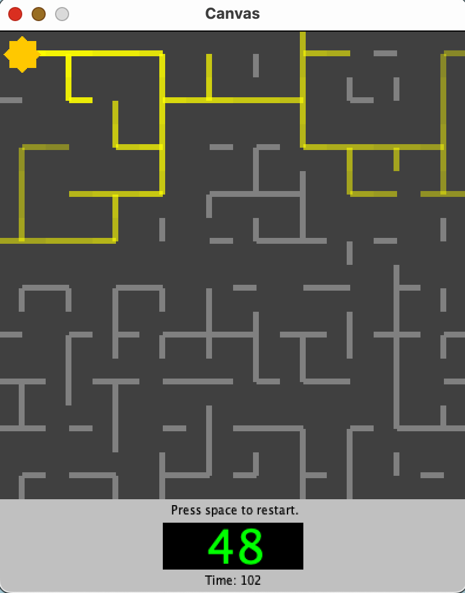
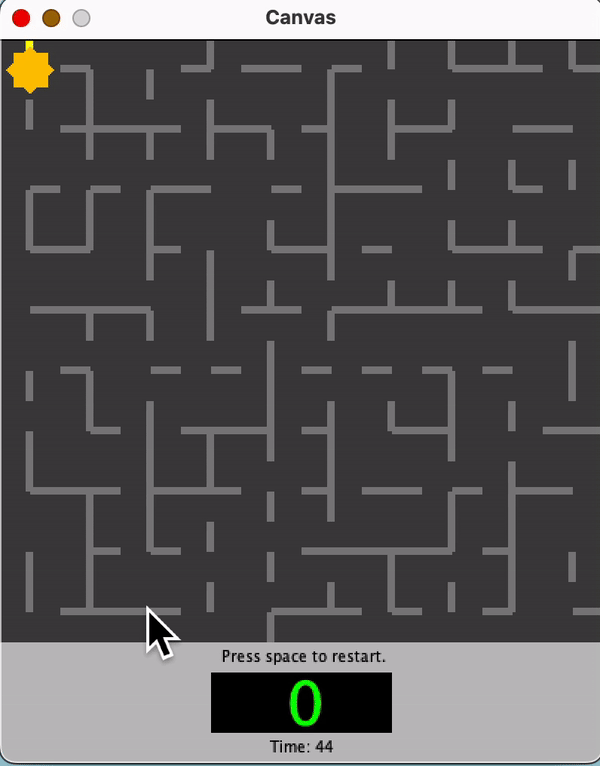

<h1 align="center">Light Em All</h1>

Welcome to LightEmAll, a puzzle game where your objective is to... do as the name says. Illuminate every line on the screen by strategically rotating lines. At the top-right corner lies the central power source. With each click, you can rotate individual lines by 90 degrees, redirecting the flow of light. Your ultimate goal is to connect every line and create an unbroken circuit where the entire grid is covered in light! Now test your puzzle-solving skills to the fullest and LightEmAll!!

     

<h6 align="center">Unique Features</h6>
<ul>
  <li>Timer - Adds Element of Urgency</li>
  <li>Counter - Vibrant Green Color & Tracks number of rotations you make</li>
</ul>
